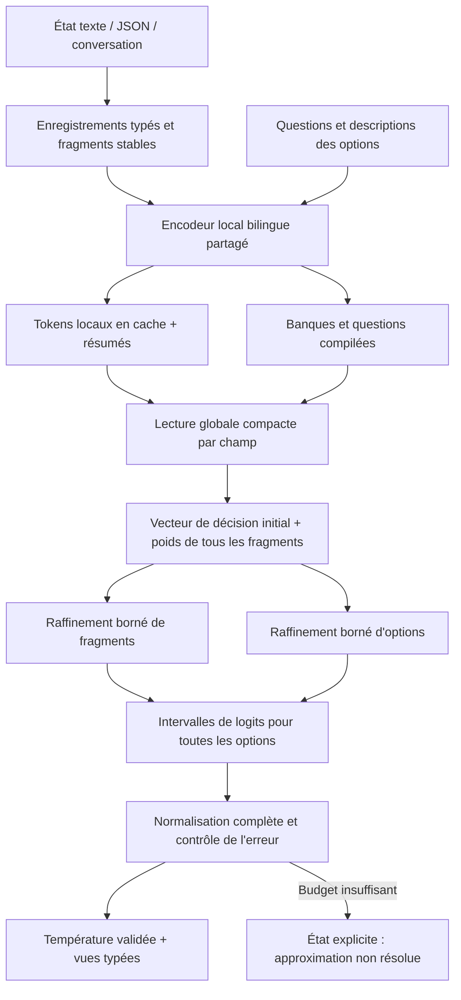

# DEX — modèle de décision à raffinement conservatif

Version 0.1, 29 septembre 2026. **Conception et code de recherche ; poids non
entraînés.** L'exécution et les propriétés algébriques se testent maintenant.
La compréhension, la calibration réelle et la supériorité sur Jev restent à établir.

## 1. Proposition

DEX lit un état et des questions à sorties bornées. Il ne possède ni décodeur
autorégressif, ni tête de vocabulaire de sortie, ni génération d'explication.
Les identifiants et valeurs retournés viennent du schéma fourni par l'application.

Le choix architectural central est le suivant : **une première décision utilise
tout l'état sous une forme compacte ; des lectures fines peuvent la corriger,
mais leur influence maximale est connue avant de les calculer.** La même règle
s'applique à l'examen détaillé des options. Une décision difficile peut demander
tout le calcul ; une décision facile peut se terminer tôt.

Le budget modifie la précision avec laquelle une fonction fixe est évaluée.
Il ne choisit pas silencieusement un autre modèle, ni un autre ensemble d'options.
Cette propriété relie long contexte, grand nombre d'options, latence et probabilités.

## 2. Les cinq axes et leurs critères

Ce sont des **objectifs de conception**, pas des performances acquises. Le tableau
de résultats mesurés est dans [MESURES.md](MESURES.md).

| Axe | Référence Jev documentée | Objectif DEX | Condition qui empêche une victoire artificielle |
|---|---|---|---|
| Contexte | 32k état + question la plus longue ; 64k requête totale | 131 072 tokens d'état, mémoire incrémentale ; test du rappel à toutes les positions | Pas de troncature ; justesse sur négation, correction tardive, double preuve et agrégation ; ingestion initiale mesurée séparément |
| Vitesse et légèreté | Service distant ; taille des poids non établie | Environ 28,4 M paramètres ; modèle < 40 Mo ; calcul local PC | Comparer la même charge et la même qualité, modèle chaud/froid, schéma compilé/non compilé, et inclure tokenizer et transferts |
| Options | 255 par Choice | 10 000 options comme première cible ; 100 000 comme extension | Distribution sur la banque complète ; coût de compilation payé explicitement ; options proches et absentes incluses |
| Champs en parallèle | Déjà pris en charge | 64 champs indépendants, puis 256 en lots | Aucun changement sémantique lorsqu'on ajoute un champ ; débit et latence mesurés, pas « temps gratuit » |
| Anglais-français | Anglais privilégié à l'entraînement | Un seul checkpoint ; FR natif, EN natif et entrées mixtes | Qualité et calibration publiées séparément ; pas seulement des traductions faciles |

La documentation publique suffit pour fixer les limites d'interface, pas pour
revendiquer une victoire de qualité ou de vitesse. [Source Jev](https://docs.typesafe.ai/models).

Cibles initiales sur **un portable PC de référence à définir et figer** :
WebGPU, contexte frais 512 tokens/32 champs/256 options ≤ 200 ms p95 ; même état
déjà encodé ≤ 40 ms ; ajout de 128 tokens à un état compilé de 32k ≤ 100 ms.
WASM a une cible distincte de 800 ms/100 ms pour frais/chaud. RAM maximale visée :
512 Mio à 128k tokens et 10k options, après streaming du runtime. Une première
lecture de 128k peut prendre des dizaines de secondes à plusieurs minutes : aucune promesse de lecture
instantanée n'est faite. Ces cibles seront révisées à partir de mesures réelles,
sans transformer les révisions en succès rétroactifs.

## 3. Architecture de référence



### Configuration implémentée

| Élément | Configuration |
|---|---|
| Vocabulaire cible | 32 768 entrées, tokenizer EN/FR à entraîner ; les essais utilisent des IDs synthétiques |
| Encodeur | 8 blocs bidirectionnels locaux, largeur 384, 6 têtes, FFN SwiGLU 1 152 |
| Fenêtre locale | 128 tokens ; positions à l'intérieur du fragment |
| Représentation de sortie | 128 dimensions par token et par résumé de fragment |
| Questions | Même encodeur, marqueur de type distinct, pooling appris |
| Options | Même encodeur, représentation normalisée de dimension 128 ; ID opaque hors réseau |
| Décision grossière | Attention des questions sur tous les résumés, puis MLP |
| Correction d'état | Attention locale conditionnée par question et décision initiale, MLP, sortie bornée |
| Correction d'option | MLP question/décision initiale/option, scalaire borné |
| Sortie | Distribution catégorielle complète ; types dérivés par code |
| Paramètres | 28 396 162 dans `dex/model.py` |

Cette configuration est volontairement mesurable. Elle n'est pas sélectionnée
par une recherche d'hyperparamètres achevée. Le rang 128 et l'option comprimée en
un vecteur sont des risques importants de capacité ; la variante avec quatre
facettes d'option et le rang 256 seront des ablations, pas des promesses ajoutées
au produit sans validation.

### État, structure et cache

`dex/state.py` conserve types JSON, null, tableaux, conteneurs vides et chemins
JSON Pointer. Les clés d'objets sont triées ; l'ordre des tableaux est conservé.
Les dialogues gardent leurs rôles et leurs tours comme données structurées. Les
chaînes qui ressemblent à des instructions restent dans l'état ; le schéma est
fourni séparément. Cette séparation n'est pas une preuve de résistance aux injections.

Frontend de production prévu : un découpage stable à l'intérieur de chaque feuille
ou tour, avec provenance vers les caractères source. Un nouveau tour n'oblige pas
à encoder les précédents. Une modification invalide sa feuille, son résumé et les
décisions qui lisent l'état. Le cache inclut checkpoint, tokenizer, quantification,
chemin, rôle et contenu ; il ne peut pas être partagé entre versions incompatibles.

Dans le réseau de référence, quatre traits de position/ancienneté sont ajoutés
**après** l'encodage local aux résumés. La lecture globale est recalculée lorsqu'un
tour est ajouté ; les représentations locales peuvent rester en cache. L'ordre
conversationnel n'est donc pas effacé par une simple moyenne des fragments.
Ces traits ne garantissent pas la résolution des pronoms ou des corrections tardives.

Le tokenizer de production n'est pas livré. Il devra utiliser un vocabulaire
équilibré EN/FR avec repli sur les octets, conserver accents et ponctuation, et
mesurer la fragmentation par langue. Le code ne remplace pas subrepticement cette
étape par un hash lexical ou un classifieur à mots-clés.

### Lecture partagée et raffinements

L'encodeur ne lit chaque nouveau fragment qu'une fois. Pour chaque champ, le
décideur calcule les poids de **tous** les fragments et un vecteur initial. Une
petite lecture conditionnée peut ensuite reprendre les tokens locaux d'un fragment.
Les corrections ne dépendent pas des autres corrections déjà calculées : leur
ordre d'exécution ne change pas la fonction complète.

Les descriptions d'options sont encodées lors de la compilation du schéma. Les
scores grossiers de toutes les options sont calculés par multiplication matricielle.
Seule leur correction coûteuse peut être omise sous contrôle. La référence ne
fait pas de recherche approchée dans la banque et n'impose pas de top-k irréversible.

Le MLP d'option ne reçoit que la représentation comprimée de sa rubrique. Il ne
relit pas, dans cette version, ses tokens originaux : perdre une exception dans
une longue rubrique est donc possible même avec un budget complet. La variante
à plusieurs facettes doit être évaluée précisément sur ce problème.

## 4. Définition mathématique

Pour un champ, soient `q` la question, `m_j` les résumés des `C` fragments et
`b_i` les vecteurs des `N` options. Le réseau calcule une distribution de routage
`a_j ≥ 0`, `Σ_j a_j = 1`, et une décision initiale `z0`.

La lecture fine du fragment `j` produit :

```text
δ_j = ρ · tanh(MLP(q, z0, attention(q,z0,tokens_j))) / √d
||δ_j||₂ ≤ ρ

z* = z0 + Σ_j a_j δ_j
e_i = λ · tanh(MLP(q, z0, b_i))       donc |e_i| ≤ λ
ℓ_i* = (s · b_iᵀ z* + e_i) / T
p* = softmax(ℓ*)
```

`ρ`, `λ` et `s` sont fixés pour un checkpoint ; `T > 0` est la température du
calibrateur validé. Les essais initiaux prennent `ρ=λ=1`, `s=8`, `T=1`.
Les poids de routage sont calculés sur tous les fragments. Une petite masse de
routage ne veut pas dire « texte sans importance dans le monde » : elle borne
seulement son effet **dans ce modèle**.

Après raffinage des fragments `K` et des options `V` :

```text
z_K = z0 + Σ_{j∈K} a_j δ_j
centre_i = (s · b_iᵀ z_K + 1[i∈V] e_i) / T
rayon_i = (s · ||b_i||₂ · ρ · Σ_{j∉K} a_j + λ · 1[i∉V]) / T
L_i = centre_i − rayon_i
U_i = centre_i + rayon_i
```

Par Cauchy-Schwarz et l'inégalité triangulaire, `L_i ≤ ℓ_i* ≤ U_i`.
Cette borne ne dépend pas de la qualité du routage, ni de la réussite de
l'entraînement. Elle reste donc valide si le réseau a appris une mauvaise tâche.
C'est sa force numérique et sa limite sémantique.

Les bornes de probabilité utilisent **toutes** les options :

```text
p_i^- = exp(L_i) / [exp(L_i) + Σ_{k≠i} exp(U_k)]
p_i^+ = exp(U_i) / [exp(U_i) + Σ_{k≠i} exp(L_k)]
```

Elles sont exactes pour une boîte indépendante de logits ; elles peuvent être
conservatrices pour les logits corrélés de DEX. Les implémentations utilisent
log-sum-exp et des préfixes/suffixes pour éviter de soustraire deux grandes masses
presque égales. Les intervalles successifs sont intersectés.

Un gagnant `w` est fixé si `L_w ≥ max_{k≠w} U_k`. On s'arrête quand cette condition
et `p_w^+ − p_w^- ≤ ε` sont satisfaites. L'estimation ponctuelle est une softmax
du centre de la boîte conservée. Son écart à `p_w*` est alors au plus `ε`.

Un événement constitué de plusieurs options se traite par somme dans la même
mesure. Pour sa borne inférieure, on prend les logits bas à l'intérieur et hauts
à l'extérieur ; l'inverse donne la borne supérieure. Additionner naïvement des
bornes marginales donnerait une borne inutilement lâche.

**Portée du mot « certifié ».** La preuve ci-dessus est en arithmétique réelle.
Le code NumPy/JavaScript inclut une marge numérique et des tests, mais pas une
implémentation d'arrondi dirigé formellement vérifiée. `argmax_certified` désigne
le critère algébrique, pas une certification logicielle ou de vérité. Une version
avec garantie machine devra contrôler explicitement toutes les erreurs d'arrondi.

## 5. Ordonnancement et budget

Le prototype raffine par petits lots le côté qui domine l'incertitude : fragments
de plus grande masse, puis options de plus grand score supérieur. Il termine en
au plus l'examen complet des deux ensembles. Ce planificateur de référence
réévalue trop de bornes dans certains cas ; le banc le montre.

Le runtime cible devra choisir entre trois voies au début d'une requête :

1. **Dense** pour petites banques et contextes courts : les matrices régulières
   peuvent battre une logique adaptative malgré davantage d'opérations.
2. **Raffinage groupé** pour grands états déjà compilés et décisions séparables.
3. **Repli dense par blocs** si les premières itérations ne ferment pas les
   intervalles. Un plafond d'itérations évite de payer longtemps le planificateur.

Ce choix demande un profil matériel et un calibrage de coûts ; il ne doit pas
changer le modèle complet. Si le budget matériel est épuisé, on retourne une
estimation, son intervalle et `budget_exhausted`. L'application ne doit pas
confondre cet état avec une décision résolue. Une forte certitude de l'argmax
peut aussi accompagner une probabilité minuscule parmi dix mille options.

Les étapes de raffinement sont des évaluations numériques, pas une génération
séquentielle de mots ni une chaîne de raisonnement textuelle. Pour une latence
stricte, on limite leur nombre et on accepte une abstention explicite.

## 6. Sorties typées et cohérence

- `choice` : ID autorisé, probabilité de cette option et éventuellement distribution.
- `boolean` : booléen, probabilité de la valeur retenue, `p_true` et `p_false`.
- `score` : niveau discret déclaré, probabilité de ce niveau, espérance séparée.
  Une espérance entre deux niveaux n'a pas de « probabilité d'être exactement vraie ».
- `event` : somme sur un sous-ensemble d'une partition déclarée.

Une option « absent », « autre » ou « information insuffisante » doit avoir sa
propre définition lorsqu'elle est pertinente. L'abstention du système est une
politique de décision, pas automatiquement une classe sémantique supplémentaire.

Deux vues explicitement liées à la même variable respectent les compléments et
les sommes de probabilités par construction. Deux questions libres qui paraissent
équivalentes ne sont pas fusionnées automatiquement. Les relations entre plusieurs
variables ne supposent pas leur indépendance ; les conjonctions demandent un modèle
joint ou un événement annoté distinct. Un produit de probabilités serait injustifié.

Les noms d'options sont des IDs opaques. Le sens doit figurer dans `description`.
Renommer un ID n'affecte donc pas l'entrée neuronale. Permuter les descriptions
permute les scores, à l'erreur d'arrondi près. En cas d'égalité exacte, le choix
d'un gagnant unique exige une règle de départage explicite ; les probabilités
restent la référence. Ajouter une option redéfinit la distribution catégorielle :
on ne promet pas une invariance injustifiée à cet ajout.

## 7. Calibration : une deuxième expérience indispensable

Une softmax n'est pas rendue calibrée par son nom. DEX optimise le score
logarithmique propre sur des réponses annotées, puis ajuste une température sur
un jeu séparé. `dex/calibration.py` fournit le calcul ; aucun calibrateur métier
n'est fourni actuellement.

Le calibrateur appartient au tuple : poids, tokenizer, export, quantification,
schéma ou famille de schémas, banque d'options, domaine, politique de budget.
Une nouvelle version invalide sa validation. On mesure NLL, Brier, fiabilité,
ECE et risque-couverture sur le système final, dans chaque langue.

La température s'applique **avant** de calculer les intervalles : une faible
température peut les élargir fortement. Calibrer seulement une liste présélectionnée
puis prétendre couvrir dix mille options est exclu. Lorsque la sortie adaptative
est à `ε` de la distribution calibrée complète, cette proximité est une borne
numérique, pas une preuve automatique de calibration conditionnelle. Il faut
également tester la politique d'arrêt et d'abstention sur données indépendantes.

## 8. Coût et faisabilité navigateur

Pour `T` tokens, fenêtre locale `L=128`, largeur `D`, `C≈T/L`, `F` champs,
`N` options, rang `r`, `K` fragments raffinés par champ et `V` options raffinées :

| Étape | Coût dominant | Réutilisation |
|---|---|---|
| Encodage local | `O(T·profondeur·(D²+L·D))` | Seulement pour contenu nouveau |
| Encodage du schéma | Proportionnel à la longueur de toutes ses descriptions | Cache par checkpoint et contenu |
| Lecture globale | `O(F·C·r)` | Refaite si état ou questions changent |
| Scores grossiers | `O(F·N·r)` | Tous calculés, même en adaptatif |
| Lecture fine | `O(F·K·L·r + F·K·r²)` | À grouper par champ/fragment |
| Correction d'options | `O(F·V·r²)` | Dépend de l'état, donc non cachée entre états |
| Bornes et normalisation | `O(F·N)` par itération de référence | Risque de surcoût observé |

Rendre toutes les probabilités coûte déjà `Ω(F·N)` éléments de sortie. DEX ne
promet ni options illimitées sans coût, ni compréhension d'un état frais sans le lire.

À 128k tokens, garder les tokens locaux en FP16 à 128 dimensions coûte environ
32 Mio, plus résumés, métadonnées, banque et buffers. À 10k options, une banque
FP16 à 128 dimensions coûte environ 2,44 Mio. Le modèle quantifié exporté et son
noyau FP32 occupent environ 29,6 Mo. Les sessions, copies CPU/GPU, poids déquantifiés
temporaires et activations peuvent multiplier cette empreinte : aucune mesure
de pic RAM navigateur à 128k n'est revendiquée.

Le `forward` dense de référence développe des tensors champ×fragment×token ; il
ne constitue **pas** le runtime mémoire bornée à 128k. Le déploiement devra lancer
les raffinements par blocs et borner les caches. La version navigateur livrée
teste 512 tokens et la voie dense. Le planificateur JS est testé séparément sur
vecteurs synthétiques. Leur intégration paresseuse ONNX complète reste à faire.

WASM CPU est mesuré d'abord ; WebGPU nécessitera une variante de quantification
et un audit des opérateurs. La disponibilité d'int8 en stockage ne garantit pas
un produit matriciel int8 rapide sur chaque GPU. Un mélange W8/W4, la QAT et des
noyaux WGSL ne seront retenus qu'après mesures et tests de calibration.
[Documentation du runtime](https://onnxruntime.ai/docs/tutorials/web/).

## 9. Limites qui peuvent faire échouer DEX

1. **Compression sémantique** : le résumé et le rang limitent les distinctions
   entre exceptions, négations et options proches. Raffiner tout ne récupère
   pas une information perdue par l'encodeur.
2. **Interactions entre fragments** : le mécanisme peut manquer une relation à
   plusieurs étapes. Une couche d'interaction globale supplémentaire peut être
   nécessaire, mais doit préserver le contrat de borne et son coût.
3. **Masse diffuse** : fermer une borne peut exiger tous les fragments et toutes
   les options. Le pire cas reste linéaire dans l'état et la banque, avec un surcoût.
4. **Résidus trop contraints** : de petites bornes accélèrent le calcul mais peuvent
   empêcher une correction nécessaire. `ρ`, `λ`, rang et qualité doivent être étudiés ensemble.
5. **Calibration hors domaine** : ni la température ni les bornes ne garantissent
   la validité des probabilités sur des tâches inconnues.
6. **Bilinguisme apparent** : des traductions alignées peuvent masquer les erreurs
   du français spontané, sans accents, mêlé à l'anglais ou aux termes métier.
7. **Régularisation qui triche** : forcer le routage à être pointu peut masquer une
   contre-preuve. Le coût ne doit jamais être le seul objectif d'entraînement.

Le critère de réussite n'est pas d'avoir utilisé une architecture inhabituelle.
C'est d'obtenir une meilleure frontière qualité/coût, avec des probabilités utiles,
sur les cinq axes et les machines réellement visées.
